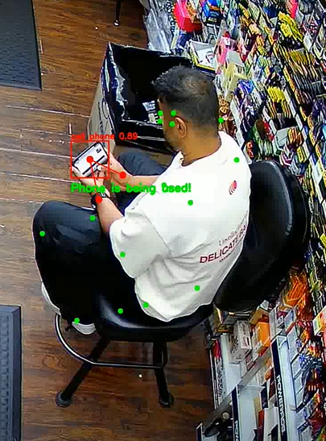

# Assignment Phone Usage Detection

## Approach
Object detection and human pose estimation combined to recognize phone usage.  
Instead of checking or comparing with only bounding boxes like in below:

I preferred to add human pose-estimation to the system. Therefore, system check the keypoint of right and left hand which is 4 and 7 in image 

Afterwards the distance between hands and phone center can be calculated. 

  

## Improvement Points 
I have used pretrained YOLOv12 (phone detection) and YOLOv11 (pose) model which is trained with COCO dataset due to my limited time.
It needs optimization. Therefore, custom trained model can be used especially for cell phone detection. 
More than thousands phones can be labelled from similar scenes and trained on YOLOv12 or RF-DETR that are state-of-art models on object detection.
Computational performance also can be increased with optimization methods such as TensorRT or ONNX. 

Note: this is not the final status of project, it will be updated.
